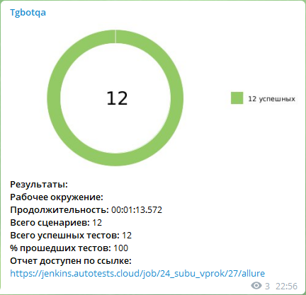

## qa_guru_at_final_project

Реализованы проверки:

## UI Автотесты на https://vprok.ru/

UI

    Отображение 'Товар недели' на главной странице
    Отображение 'Суперцены недели' на главной странице
    Проверка ссылки 'Упаковкой дешевле'
    Проверка что в заголовках блока зоотовары есть подзаголовок 'лакомства для кошек'
    Проверка подзаголовка в категории 'Зоотовары'
    Проверка поиска по продукту 'молоко'
    Проверка отправки смс кода при регистрации нового клиента
    Проверка фильтрации в категории  'Чай, кофе, сахар'
    Положить товар в козину

## API  Автотесты на https://reqres.in/

API

    "Создание нового пользователя"
    "Запрос пользовательских данных"
    "Проверка ответа в блоке support.Url"
    "Неуспешное создание нового пользователя(негативный)"
    "Успешное создание нового пользователя(негативный)"

### Запуск тестов

Локальный запуск:

    gradle clean test

Локальный запуск с количественным параметром запускаемых потоков:

    gradle clean test -Dthreads=5

Удаленный запуск тестов:

    gradle clean test -Ddriver=remote

Запуск тестов через джобу в [Jenkins](https://jenkins.autotests.cloud/job/24_subu_vprok/build?delay=0sec)

### Параметры используемые при запуске тестов:

### Статистика запусков:

### Отчёт в Allure Report

### Интеграция [Allure Test Ops](https://allure.autotests.cloud/project/627/dashboards) с [Jira](https://jira.autotests.cloud/browse/HOMEWORK-250)  :

### Хранение тест-кейсов в Allure TestOps
Дашборд

Дашборд по видам тестов

Запуски

Результат запуска

Тест-кейсы

### Видео о прохождении тестов
.gif)

### Уведомления о завершении прогона автотестов в Telegram
